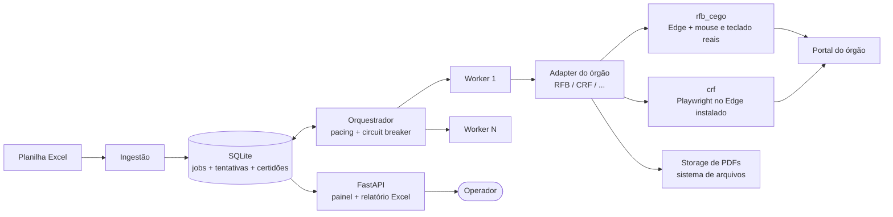

# 02 — Arquitetura

## 1. Visão em um parágrafo

Um **monólito modular** em Python, numa estação Windows comum: a ingestão lê a
planilha e materializa *jobs* num banco SQLite que também funciona como fila; um
**orquestrador** distribui jobs a **workers**, cada um executando o **adapter**
do órgão correspondente; o resultado de cada tentativa atualiza a máquina de
estados do job; um processo web (FastAPI) serve o **painel** e o **relatório de
saída** lendo o mesmo banco. Não há broker de mensagens, nem microserviços, nem
dependência externa de infraestrutura — ver
[ADR-002](adr/ADR-002-sqlite-fila-no-banco.md).

**Como o worker toca o portal é decisão de cada adapter, não da arquitetura** —
é justamente o que a fronteira do adapter isola. Hoje há duas técnicas em uso, e
a diferença nasceu do portal e não de preferência: a Receita **detecta**
automação de navegador (teste A/B em 07/08/2026, mesmo CNPJ e mesmo IP — a
consulta manual passou e a do robô tomou bloqueio 106), e a SEFAZ-ES não libera
Turnstile em Playwright/CDP. Por isso `rfb_cego` e `sefaz_es` abrem o Edge comum
e mexem no **mouse e no teclado do Windows** por cima, via `SendInput`, lendo a
tela por pixel. O CRF da Caixa usa ShieldSquare/Radware, que barra `urllib` mas
**não** barrou o Playwright dirigindo o Edge, então o `crf` é **por elemento** —
sem calibragem e sem coordenada de tela. Ver
[ADR-001](adr/ADR-001-python-playwright.md) e [ADR-003](adr/ADR-003-adapter-por-orgao.md).

Consequência prática: **não é servidor**. O robô cego assume o mouse e o teclado
de verdade, e por isso a máquina precisa de sessão gráfica logada e destravada —
ninguém pode usá-la enquanto ele roda.

## 2. Componentes



### 2.1 Ingestão

- Lê a planilha (`openpyxl`/`pandas`), uma aba por órgão.
- Normaliza documentos: remove máscara, valida dígito verificador (CNPJ numérico
  **e alfanumérico**, CPF), deduplica por (documento, órgão).
- Itens inválidos não viram job: vão para a aba "erros de entrada" do relatório,
  com o motivo.
- Cria um **lote** e um **job** por item válido.
- É a única camada que conhece Excel. Trocar a fonte (API, ERP, CSV) = trocar só
  este módulo (RF-09 / premissa da fonte de dados não definitiva).

### 2.2 Banco + fila

- SQLite em modo WAL, arquivo único em `data/cnd.db`.
- A fila é a própria tabela `job` com status + `proxima_execucao_em`; o
  orquestrador faz *claim* atômico (`UPDATE ... WHERE status='PENDING' ...`).
- Justificativa e limites no [ADR-002](adr/ADR-002-sqlite-fila-no-banco.md).

### 2.3 Orquestrador

Processo único, dono de todas as decisões de **quando** e **o quê** executar:

- Respeita o **pacing por órgão** (intervalo com jitter entre consultas — ver
  [doc 04](04-ciclo-de-vida-retry-captcha.md#3-pacing)).
- Mantém o **circuit breaker por órgão**: muitos captchas/falhas em janela curta
  ⇒ pausa o órgão inteiro por um cooldown, sem afetar os demais.
- Recupera jobs órfãos (`RUNNING` sem worker vivo) na subida (RNF-08).
- Aplica a política de retry/backoff da [doc 04](04-ciclo-de-vida-retry-captcha.md).

### 2.4 Workers

- Concorrência inicial: **1 worker por órgão** (`[orgaos.*] workers`).
- **Receita Federal (`rfb_cego`) e SEFAZ-ES (`sefaz_es`)** — sem navegador automatizado. O Edge comum é
  dirigido por `SendInput`: cursor em curva de Bézier com tremor, cliques do
  sistema, digitação tecla por tecla (a máscara do campo de CNPJ é acionada por
  tecla, e preencher de uma vez faz o portal recusar documento válido). Enxerga
  por cor de pixel — véu do modal, faixa amarela de aviso, faixa rosa de erro —
  e a calibragem é guardada em **proporções da janela** (0..1), o que a faz
  servir em telas de resolução diferente.
- **CRF da Caixa (`crf`)** — Playwright dirigindo o **Edge instalado**
  (`channel="msedge"`), não um Chromium baixado: por elemento, sem calibragem.
- **Perfil do Edge**: a Receita devolve cookies a cada emissão, eles se acumulam
  no perfil e, passado o limite do nginx, TODA requisição ao domínio volta
  `400 Request Header Or Cookie Too Large`. O adapter apaga os cookies daquele
  domínio e refaz a consulta — ver `infra/perfil_edge.py`.
  Escalar só com dados do dashboard mostrando taxa de captcha baixa.
- O worker não conhece regra de negócio: recebe um job, invoca o adapter, devolve
  um `ResultadoTentativa`.

### 2.5 Adapters (um por órgão)

Interface única ([ADR-003](adr/ADR-003-adapter-por-orgao.md)):

```python
class AdapterOrgao(Protocol):
    orgao: str                      # "RFB_PJ", "CRF", "SEFAZ_GO", ...

    def emitir(self, page: Page, doc: Documento) -> ResultadoTentativa:
        """Executa o fluxo completo no portal para um documento.
        Nunca lança exceção de negócio: todo desfecho vira ResultadoTentativa.
        Exceções inesperadas são capturadas pelo worker como ERRO_TECNICO
        (com screenshot + HTML salvos)."""

@dataclass
class ResultadoTentativa:
    desfecho: Desfecho              # ver doc 04, seção 1
    caminho_pdf: Path | None        # quando houve emissão
    validade: date | None
    codigo_controle: str | None
    mensagem_portal: str | None     # texto cru exibido pelo site
```

Responsabilidades do adapter: navegação, seletores, detecção de captcha,
download do PDF, extração de metadados, **classificação do desfecho**. Tudo que é
específico do site mora aqui; o núcleo (fila, retry, dashboard) nunca muda ao
adicionar um órgão.

### 2.6 Storage de PDFs

Sistema de arquivos, organizado para consulta humana direta:

```
data/certidoes/{lote_id}/{orgao}/{documento}_{data_emissao}.pdf
```

Hash SHA-256 e caminho registrados na tabela `certidao` (integridade + dedupe).

### 2.7 Web (dashboard + relatório)

FastAPI servindo páginas server-rendered com HTMX
([ADR-005](adr/ADR-005-dashboard-fastapi-htmx.md)); detalhes na
[doc 05](05-observabilidade-dashboard.md). Processo separado do orquestrador —
uma queda não derruba a outra; ambos leem o mesmo SQLite.

## 3. Fluxo ponta a ponta (caminho feliz)

```mermaid
sequenceDiagram
    participant O as Operador
    participant I as Ingestão
    participant Q as Orquestrador
    participant W as Worker
    participant A as Adapter RFB
    participant P as Portal RFB

    O->>I: importa planilha (cria lote)
    I->>Q: 2.850 jobs PENDING
    loop até fila vazia, respeitando pacing
        Q->>W: claim do próximo job
        W->>A: emitir(page, cnpj)
        A->>P: navega, consulta, baixa PDF
        A-->>W: ResultadoTentativa(NEGATIVA, pdf, validade)
        W->>Q: job DONE
    end
    O->>O: acompanha no dashboard; exporta Excel ao final
```

## 4. Estrutura de diretórios

```
acta/
├── pyproject.toml
├── config.exemplo.toml        # o que É versionado: os comentários, sem valor preenchido
├── config.toml                # o da INSTALAÇÃO — senha, endereço, AnyDesk (fora do git)
├── src/cnd/
│   ├── ingestao/              # leitura Excel, validação de documentos
│   ├── core/                  # domínio: entidades, máquina de estados, fila, controle
│   ├── orquestrador/          # loop principal, pacing, circuit breaker, vigilância
│   ├── adapters/              # por âmbito: é o âmbito que decide quem é o órgão
│   │   ├── base.py            # Protocol + o mapa nome-do-config → módulo
│   │   ├── calibragem.py      # ensina ao robô cego onde ficam os campos
│   │   ├── fake.py            # órgão de mentira, para ensaiar sem portal
│   │   ├── federal/
│   │   │   ├── rfb_cego.py    # Receita Federal PJ, por mouse e teclado reais ← ativo
│   │   │   ├── rfb_pj.py      # o mesmo portal por Playwright — DETECTADO, desligado
│   │   │   ├── rfb_matriz.py  # leitura da certidão da matriz
│   │   │   ├── rfb_pdf.py     # leitura do PDF da Receita
│   │   │   └── crf.py         # Caixa — FGTS, por Playwright no Edge instalado
│   │   ├── estadual/
│   │   │   ├── sefaz_go.py    # SEFAZ-GO, por HTTP
│   │   │   └── sefaz_es.py    # SEFAZ-ES, por mouse/teclado reais
│   │   └── municipal/         # ainda vazio — o primeiro município entra aqui
│   ├── web/                   # FastAPI: painel, API, relatório Excel, ZIP
│   ├── desktop/               # o aplicativo de mesa e o acesso remoto
│   ├── infra/                 # db, config, logging, tela, entrada, Teams, arquivos
│   └── lancador.py            # ponto de entrada do ACTA.exe
├── empacotar/                 # construir.py (PyInstaller) e publicar.py (rede local)
├── tests/                     # sem rede e sem portal; adapters/ espelha os âmbitos
└── data/                      # cnd.db, certidoes/, evidencias/, calibragem/ (fora do git)
```

## 5. Execução e deploy

- **Processos:** `cnd rodar` (o robô) e `cnd painel` (o painel web), separados de
  propósito — reiniciar um não para o outro. Windows comum, não Windows Server:
  o robô cego move o mouse de verdade e precisa de uma sessão gráfica logada e
  destravada. Quem sobe o painel na inicialização é o Agendador de Tarefas
  (tarefa `ACTA Painel`), e não um serviço.
- **Configuração:** o `config.toml` **não** vai para o controle de versão. Ele é
  da instalação, não do programa: traz a senha do painel, o endereço da máquina
  e o número do AnyDesk dela. Versionado, a senha viajava junto — foi retirada
  do histórico inteiro em 18/08/2026, antes de o repositório ir para o GitHub.
  O que se versiona é o `config.exemplo.toml`, com os mesmos comentários e nenhum
  valor preenchido. Segredo mesmo vai por variável de ambiente (`CND_REDE_SENHA`,
  `CND_TEAMS_WEBHOOK`, `CND_GRAPH_SECRET`, `CND_SMTP_SENHA`), que têm prioridade
  sobre o arquivo.
- **Backup:** o estado inteiro é `data/` (banco + PDFs + calibragem) — copiar o
  diretório é o backup completo.
- **Atualização de adapter quebrado:** não há `git pull` na máquina do robô, que
  roda a pasta empacotada. O console publica o pacote na rede local
  (`empacotar/publicar.py`) e o painel de cada máquina o baixa e troca os
  arquivos, conferindo o SHA-256 antes — ver docs/07. O circuit breaker já terá
  pausado o órgão afetado; os demais seguem rodando.
