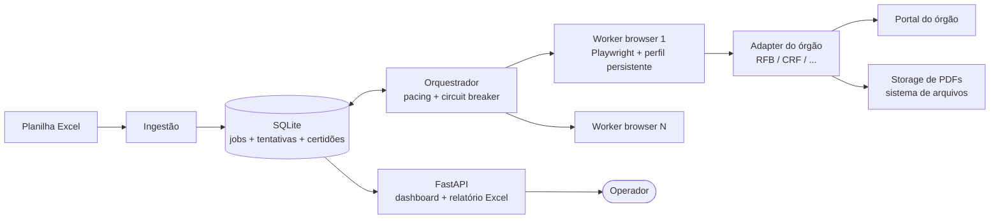

# 02 — Arquitetura

## 1. Visão em um parágrafo

Um **monólito modular** em Python num único servidor: a ingestão lê a planilha e
materializa *jobs* num banco SQLite que também funciona como fila; um
**orquestrador** distribui jobs a **workers** de browser (Playwright), cada um
executando o **adapter** do órgão correspondente; o resultado de cada tentativa
atualiza a máquina de estados do job; um processo web (FastAPI) serve o
**dashboard** e o **relatório de saída** lendo o mesmo banco. Não há broker de
mensagens, nem microserviços, nem dependência externa de infraestrutura — ver
[ADR-002](adr/ADR-002-sqlite-fila-no-banco.md).

## 2. Componentes



### 2.1 Ingestão

- Lê a planilha (`openpyxl`/`pandas`), uma aba por órgão.
- Normaliza documentos: remove máscara, valida dígito verificador (CNPJ numérico
  **e alfanumérico**, CPF), deduplica por (documento, órgão).
- Itens inválidos não viram job: vão para a aba "erros de entrada" do relatório,
  com o motivo.
- Cria um **lote** e um **job** por item válido.
- É a única camada que conhece Excel. Trocar a fonte (API, ERP, CSV) = trocar só
  este módulo (RF-09 / premissa da fonte de dados não definitiva).

### 2.2 Banco + fila

- SQLite em modo WAL, arquivo único em `data/cnd.db`.
- A fila é a própria tabela `job` com status + `proxima_execucao_em`; o
  orquestrador faz *claim* atômico (`UPDATE ... WHERE status='PENDING' ...`).
- Justificativa e limites no [ADR-002](adr/ADR-002-sqlite-fila-no-banco.md).

### 2.3 Orquestrador

Processo único, dono de todas as decisões de **quando** e **o quê** executar:

- Respeita o **pacing por órgão** (intervalo com jitter entre consultas — ver
  [doc 04](04-ciclo-de-vida-retry-captcha.md#3-pacing)).
- Mantém o **circuit breaker por órgão**: muitos captchas/falhas em janela curta
  ⇒ pausa o órgão inteiro por um cooldown, sem afetar os demais.
- Recupera jobs órfãos (`RUNNING` sem worker vivo) na subida (RNF-08).
- Aplica a política de retry/backoff da [doc 04](04-ciclo-de-vida-retry-captcha.md).

### 2.4 Workers de browser

- Playwright + Chromium **headed** rodando em display virtual (xvfb no Linux) —
  headless puro tem fingerprint mais detectável.
- **Um perfil persistente por worker** (`user-data-dir` próprio): cookies e
  storage sobrevivem entre jobs e execuções, imitando um usuário recorrente.
- Concorrência inicial: **1 worker por órgão** (config `workers_por_orgao`).
  Escalar só com dados do dashboard mostrando taxa de captcha baixa.
- O worker não conhece regra de negócio: recebe um job, invoca o adapter, devolve
  um `ResultadoTentativa`.

### 2.5 Adapters (um por órgão)

Interface única ([ADR-003](adr/ADR-003-adapter-por-orgao.md)):

```python
class AdapterOrgao(Protocol):
    orgao: str                      # "RFB_PJ", "CRF", "SEFAZ_GO", ...

    def emitir(self, page: Page, doc: Documento) -> ResultadoTentativa:
        """Executa o fluxo completo no portal para um documento.
        Nunca lança exceção de negócio: todo desfecho vira ResultadoTentativa.
        Exceções inesperadas são capturadas pelo worker como ERRO_TECNICO
        (com screenshot + HTML salvos)."""

@dataclass
class ResultadoTentativa:
    desfecho: Desfecho              # ver doc 04, seção 1
    caminho_pdf: Path | None        # quando houve emissão
    validade: date | None
    codigo_controle: str | None
    mensagem_portal: str | None     # texto cru exibido pelo site
```

Responsabilidades do adapter: navegação, seletores, detecção de captcha,
download do PDF, extração de metadados, **classificação do desfecho**. Tudo que é
específico do site mora aqui; o núcleo (fila, retry, dashboard) nunca muda ao
adicionar um órgão.

### 2.6 Storage de PDFs

Sistema de arquivos, organizado para consulta humana direta:

```
data/certidoes/{lote_id}/{orgao}/{documento}_{data_emissao}.pdf
```

Hash SHA-256 e caminho registrados na tabela `certidao` (integridade + dedupe).

### 2.7 Web (dashboard + relatório)

FastAPI servindo páginas server-rendered com HTMX
([ADR-005](adr/ADR-005-dashboard-fastapi-htmx.md)); detalhes na
[doc 05](05-observabilidade-dashboard.md). Processo separado do orquestrador —
uma queda não derruba a outra; ambos leem o mesmo SQLite.

## 3. Fluxo ponta a ponta (caminho feliz)

```mermaid
sequenceDiagram
    participant O as Operador
    participant I as Ingestão
    participant Q as Orquestrador
    participant W as Worker
    participant A as Adapter RFB
    participant P as Portal RFB

    O->>I: importa planilha (cria lote)
    I->>Q: 2.850 jobs PENDING
    loop até fila vazia, respeitando pacing
        Q->>W: claim do próximo job
        W->>A: emitir(page, cnpj)
        A->>P: navega, consulta, baixa PDF
        A-->>W: ResultadoTentativa(NEGATIVA, pdf, validade)
        W->>Q: job DONE
    end
    O->>O: acompanha no dashboard; exporta Excel ao final
```

## 4. Estrutura de diretórios proposta

```
cnd-app/
├── pyproject.toml
├── config.toml                # pacing, workers, limites de retry — sem segredo em código
├── src/cnd/
│   ├── ingestao/              # leitura Excel, validação de documentos
│   ├── core/                  # domínio: entidades, máquina de estados, fila
│   ├── orquestrador/          # loop principal, pacing, circuit breaker
│   ├── adapters/
│   │   ├── base.py            # Protocol + ResultadoTentativa
│   │   ├── rfb_pj.py          # Fase 1
│   │   └── ...                # crf.py, rfb_pf.py, sefaz_go.py, ... (fases 2+)
│   ├── web/                   # FastAPI: dashboard, export Excel
│   └── infra/                 # db, logging, storage de arquivos
├── tests/
│   ├── unit/                  # validação de documentos, máquina de estados, fila
│   └── adapters/              # testes contra HTML gravado (fixtures), sem rede
└── data/                      # cnd.db, certidoes/, evidencias/  (fora do git)
```

## 5. Execução e deploy

- **Processos:** `cnd orquestrador` e `cnd web` (dois serviços). No Linux:
  systemd units ou Docker Compose; no Windows Server: serviços via NSSM ou
  Task Scheduler com restart automático.
- **Configuração:** `config.toml` versionado com defaults + overrides locais;
  nada sensível no repositório.
- **Backup:** o estado inteiro é `data/` (banco + PDFs) — copiar o diretório é o
  backup completo.
- **Atualização de adapter quebrado:** deploy é `git pull` + restart; o circuit
  breaker já terá pausado o órgão afetado, os demais seguem rodando.
