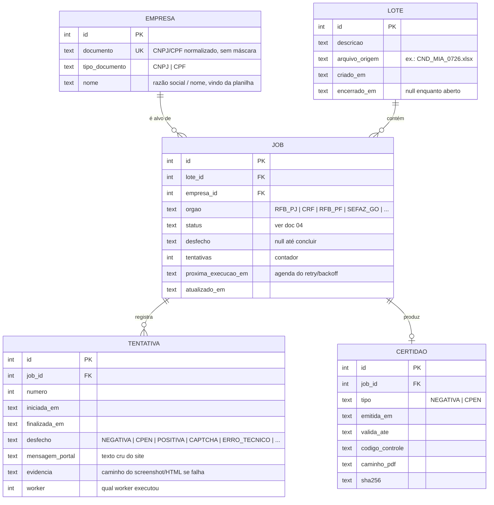

# 03 — Modelo de dados

## 1. Entidades



## 2. Decisões de modelagem

- **`EMPRESA` separada de `JOB`:** a mesma empresa aparece em vários lotes e
  vários órgãos; histórico de certidões por empresa vira consulta trivial.
- **`JOB` = (lote × empresa × órgão):** é a unidade da fila e da máquina de
  estados. `UNIQUE(lote_id, empresa_id, orgao)` impede duplicata na ingestão.
- **`TENTATIVA` separada:** cada execução real vira uma linha — auditoria
  completa (RNF-05) e matéria-prima das métricas do dashboard (taxa de captcha
  por hora, duração média, etc.) sem poluir o job.
- **`CERTIDAO` separada e imutável:** o PDF emitido é um fato datado. Permite a
  regra de idempotência (RNF-04): antes de executar um job, o orquestrador
  verifica se já existe certidão **emitida no mês corrente** para
  (empresa, órgão, **planilha**) e, se existir, conclui o job como
  `APROVEITADA` sem ir ao portal.
  A planilha entra na chave por decisão da operação (14/08/2026): duas
  remessas são trabalhos separados ainda que tragam os mesmos CNPJs, e quem
  manda a mesma lista de novo está pedindo certidões novas — não um
  relatório de que já existem. Sem ela, a segunda remessa fechava inteira
  como `APROVEITADA`, sem PDF novo. Ver `core/fila.certidao_do_mes`.
  O critério é `emitida_em`, **não** `valida_ate`: a certidão da RFB vale 180
  dias, mas quem a recebe exige emissão do mês. Usar a validade faria o robô
  pular empresas que precisam de certidão nova e marcá-las como concluídas —
  erro que não quebra nada e por isso passaria despercebido.
- **Datas como TEXT ISO-8601 (UTC):** convenção do SQLite; ordenável e legível.
- **Fila no banco:** `status + proxima_execucao_em` + claim atômico via
  `UPDATE ... RETURNING`. Sem tabela de fila separada — o job é a mensagem.

## 3. Schema SQL (referência)

```sql
PRAGMA journal_mode = WAL;
PRAGMA foreign_keys = ON;

CREATE TABLE empresa (
    id              INTEGER PRIMARY KEY,
    documento       TEXT NOT NULL,
    tipo_documento  TEXT NOT NULL CHECK (tipo_documento IN ('CNPJ','CPF')),
    nome            TEXT NOT NULL,
    UNIQUE (documento)
);

CREATE TABLE lote (
    id              INTEGER PRIMARY KEY,
    descricao       TEXT NOT NULL,
    arquivo_origem  TEXT,
    criado_em       TEXT NOT NULL DEFAULT (strftime('%Y-%m-%dT%H:%M:%fZ','now')),
    encerrado_em    TEXT
);

CREATE TABLE job (
    id                  INTEGER PRIMARY KEY,
    lote_id             INTEGER NOT NULL REFERENCES lote(id),
    empresa_id          INTEGER NOT NULL REFERENCES empresa(id),
    orgao               TEXT NOT NULL,
    status              TEXT NOT NULL DEFAULT 'PENDING',
    desfecho            TEXT,
    tentativas          INTEGER NOT NULL DEFAULT 0,
    proxima_execucao_em TEXT NOT NULL DEFAULT (strftime('%Y-%m-%dT%H:%M:%fZ','now')),
    atualizado_em       TEXT NOT NULL DEFAULT (strftime('%Y-%m-%dT%H:%M:%fZ','now')),
    UNIQUE (lote_id, empresa_id, orgao)
);
CREATE INDEX idx_job_fila ON job (orgao, status, proxima_execucao_em);

CREATE TABLE tentativa (
    id              INTEGER PRIMARY KEY,
    job_id          INTEGER NOT NULL REFERENCES job(id),
    numero          INTEGER NOT NULL,
    iniciada_em     TEXT NOT NULL,
    finalizada_em   TEXT,
    desfecho        TEXT,
    mensagem_portal TEXT,
    evidencia       TEXT,
    worker          INTEGER
);
CREATE INDEX idx_tentativa_job ON tentativa (job_id);

CREATE TABLE certidao (
    id              INTEGER PRIMARY KEY,
    job_id          INTEGER NOT NULL REFERENCES job(id),
    tipo            TEXT NOT NULL CHECK (tipo IN ('NEGATIVA','CPEN')),
    emitida_em      TEXT NOT NULL,
    valida_ate      TEXT,
    codigo_controle TEXT,
    caminho_pdf     TEXT NOT NULL,
    sha256          TEXT NOT NULL
);
CREATE INDEX idx_certidao_job ON certidao (job_id);
```

## 4. Normalização de documentos

- Armazenar **sem máscara**, apenas os caracteres significativos; máscara é
  responsabilidade da apresentação.
- **CNPJ:** aceitar o formato numérico clássico e o **alfanumérico** (novo padrão
  RFB — 12 caracteres alfanuméricos + 2 dígitos verificadores numéricos,
  DV calculado sobre `valor ASCII − 48`). Validação implementada uma vez em
  `core/documentos.py`, com bateria de testes.
- **CPF:** validação clássica de 11 dígitos + DVs; rejeitar sequências repetidas.
- Falha de validação ⇒ item não vira job; entra no relatório de erros de entrada
  com o valor original da planilha e o motivo.

## 5. Armazenamento de arquivos

| Tipo | Caminho | Retenção |
|---|---|---|
| Certidões (PDF) | `data/certidoes/{lote_id}/{orgao}/{documento}_{emitida_em}.pdf` | Permanente (é o produto) |
| Evidências de falha | `data/evidencias/{job_id}/{tentativa}/screenshot.png` + `pagina.html` | 90 dias (limpeza agendada) |
| Banco | `data/cnd.db` (+ `-wal`, `-shm`) | Permanente; backup = cópia do diretório `data/` |
