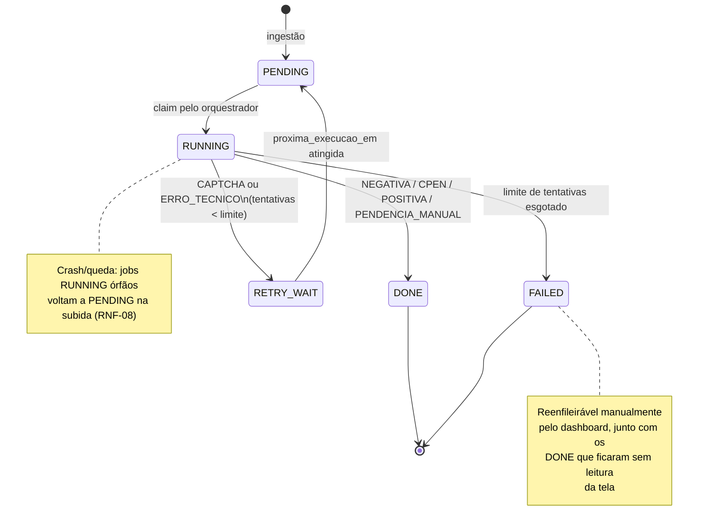
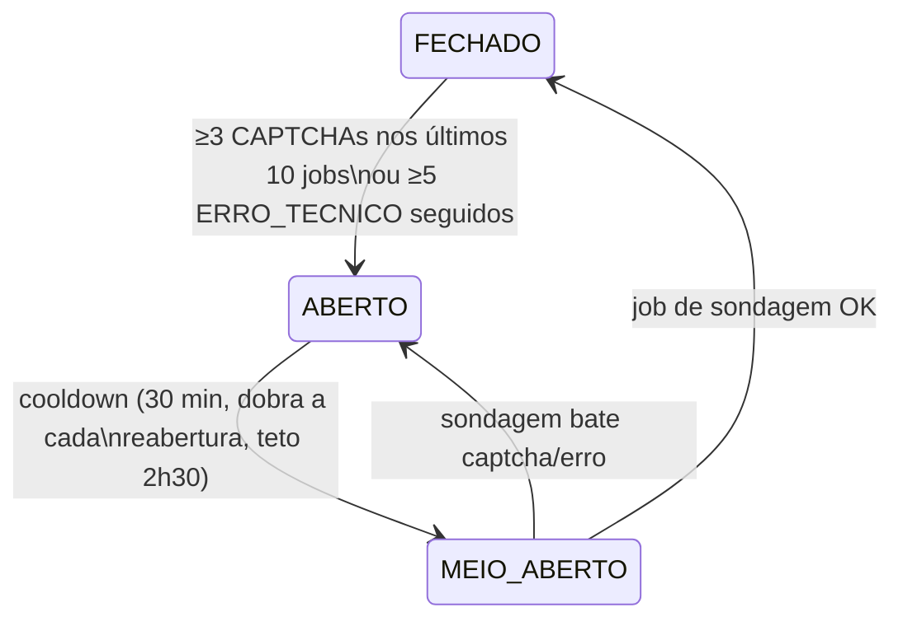

# 04 — Ciclo de vida do job, retry e estratégia de captcha

## 1. Desfechos de uma tentativa

Todo retorno de adapter é um destes valores — a distinção entre **resultado de
negócio** e **falha de processo** (RF-04) nasce aqui:

| Desfecho | Natureza | Significado | Gera retry? |
|---|---|---|---|
| `NEGATIVA` | Negócio | Certidão negativa emitida, PDF baixado | Não |
| `CPEN` | Negócio | Certidão **positiva com efeitos de negativa** emitida, PDF baixado | Não |
| `POSITIVA` | Negócio | Portal reporta pendência impeditiva; não há certidão a baixar no fluxo padrão | Não |
| `PENDENCIA_MANUAL` | Negócio | Portal exige ação fora do fluxo (e-CAC, atendimento, dados insuficientes) | Não |
| `CAPTCHA` | Bloqueio | Heurística antirrobô acionou o desafio | Sim (backoff longo) |
| `ERRO_TECNICO` | Processo | Timeout, seletor não encontrado, erro 5xx, exceção inesperada | Sim (backoff curto) |

> `POSITIVA` e `PENDENCIA_MANUAL` **não são erros**: são respostas definitivas do
> órgão sobre aquela empresa naquele momento. Reprocessá-las automaticamente não
> muda o resultado — elas vão direto para o relatório.

Só entra em `PENDENCIA_MANUAL` o que o robô **leu** na tela. Tela que ele não
conseguiu ler é `ERRO_TECNICO`, mesmo sem exceção nenhuma: em 15/08/2026 o
portal passou a responder `400 Bad Request — Request Header Or Cookie Too
Large` (nginx recusando por cookie acumulado no perfil do Edge), e uma
sequência inteira de empresas foi encerrada como pendência que não existia.
Nesse caso específico o adapter cego limpa os cookies do domínio, reabre o
navegador e refaz a consulta na hora — ver `infra/cookies.py`.

## 2. Máquina de estados do job



- `DONE` carrega o desfecho de negócio no campo `job.desfecho` (inclui
  `APROVEITADA` quando uma certidão vigente foi reutilizada — RNF-04).
- `FAILED` sempre tem a última evidência (screenshot + HTML) vinculada.

## 3. Pacing (evitar o captcha, não resolvê-lo)

O captcha da RFB é comportamental (doc 01, §3), e o critério exato não é
documentado. Em vez de chutar um intervalo fixo (rápido demais = queima o IP;
lento demais = desperdiça dias), o ritmo é **adaptativo**, no padrão AIMD do
controle de congestão do TCP: acelera aos poucos enquanto está limpo, pune
forte ao primeiro sinal de bloqueio.

**Regra:**

- A cada `acelera_apos` consultas seguidas **sem** captcha, o intervalo-base é
  multiplicado por `fator_aceleracao` (< 1) — acelera gradualmente até o teto
  de velocidade (`intervalo_piso_s`).
- Ao ocorrer **captcha**, o intervalo-base é multiplicado por `fator_punicao`
  (limitado a `intervalo_teto_s`) e a contagem de aceleração zera.
- Cada espera individual recebe jitter (±30%) para nunca ser metronômica.
- O **circuit breaker** (§5) segue como freio de emergência para rajadas de
  captcha, com alerta por e-mail (doc 05 §4).

```toml
[orgaos.RFB_PJ]
workers = 1

[orgaos.RFB_PJ.pacing]
intervalo_inicial_s = 10      # ponto de partida moderado
intervalo_piso_s    = 1       # velocidade máxima que o sistema pode atingir
intervalo_teto_s    = 300     # velocidade mínima após punições acumuladas
acelera_apos        = 25      # consultas limpas seguidas para acelerar
fator_aceleracao    = 0.8     # −20% no intervalo a cada aceleração
fator_punicao       = 4.0     # ×4 no intervalo ao bater captcha
janela_ativa        = "00:00-24:00"
```

O intervalo-base corrente é persistido no banco e exibido no dashboard
("ritmo atual") — sobrevive a restart e dispensa tuning manual.

**Consequência prática:** se o portal tolerar ritmo alto, o sistema converge
para perto do piso em ~1 h de operação e o lote de 2.850 sai em **horas**; se
a heurística reagir, ele se acomoda sozinho no ritmo sustentável (pior caso
comparável ao pacing fixo conservador, ~2–4 dias). Nos dois cenários, ninguém
precisa intervir. Lotes seguintes são incrementais (só certidões vencidas,
RNF-04).

O piloto da Fase 1 (50 CNPJs) roda exatamente este mecanismo **antes** do lote
completo — mede a reação do portal com pouco a perder e valida os parâmetros
iniciais.

Complementos comportamentais no worker (inalterados pelo ritmo):

- Navegador **headed** com perfil persistente por worker (cookies/fingerprint
  estáveis de "usuário recorrente").
- Digitação e cliques com micro-atrasos aleatórios (APIs nativas do Playwright).
- Nunca duas consultas no mesmo instante para o mesmo órgão, mesmo com N workers.

## 4. Retry e backoff

| Situação | Política |
|---|---|
| `ERRO_TECNICO` | Backoff exponencial com jitter: 2 min → 10 min → 45 min; máx. **4 tentativas**; depois `FAILED` |
| `CAPTCHA` | Backoff longo com jitter: 1 h → 4 h → 12 h; máx. **4 tentativas**; a partir da 2ª ocorrência, reiniciar o contexto do browser (sessão nova) antes de tentar; depois `FAILED` |
| `RESULTADO_PENDENTE` | Portal indisponível/processando: volta para a fila e tenta de novo em **1 h**; não conta como bloqueio do órgão |
| `FAILED` | Terminal para o sistema; dashboard permite reenfileirar em massa após correção da causa |

Backoff calculado no orquestrador ao gravar `RETRY_WAIT`:
`proxima_execucao_em = agora + base[tentativa] * uniform(0.8, 1.3)`.

## 5. Circuit breaker por órgão

Retry por item não basta: se a heurística bloqueou, insistir com **outros** itens
do mesmo órgão só reforça o sinal de robô. Por isso o disjuntor é **por órgão**:



- **ABERTO:** nenhum job do órgão é despachado; os demais órgãos seguem normais
  (RF-05 em escala de fila).
- **MEIO_ABERTO:** despacha 1 job de sondagem; o resultado decide o estado.
- Transições registradas em log e exibidas no dashboard com timestamp e motivo.

## 6. Fila de resolução assistida (fallback opcional, fase 2+)

Para itens `FAILED` por captcha persistente, uma tela do dashboard lista os casos
e permite ao operador abrir uma sessão de browser do próprio sistema, resolver o
desafio **uma vez** e devolver o item à fila com a sessão aquecida. Intervenção
humana agregada e opcional — compatível com RNF-02 (o que o requisito veta é a
resolução manual *por item* como parte do fluxo normal).

**Não** usaremos serviços de resolução de captcha terceirizados — justificativa
completa no [ADR-004](adr/ADR-004-estrategia-captcha.md).

## 7. Detecção de captcha e de mudança de layout

- Cada adapter declara **assinaturas de captcha** (seletores/iframes hCaptcha
  etc.) verificadas em todos os pontos de espera do fluxo.
- Página que não bate nem com o fluxo esperado nem com assinatura de captcha ⇒
  `ERRO_TECNICO` com screenshot + HTML salvos (provável mudança de layout —
  risco R1).
- **Canário diário:** 1 CNPJ de controle por órgão, executado de madrugada;
  falha do canário gera alerta no dashboard antes de queimar o lote inteiro.
