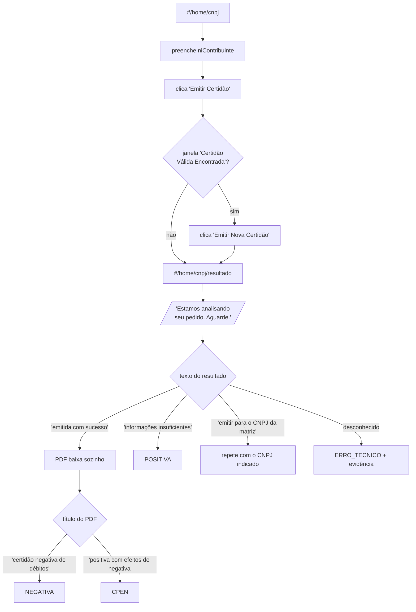

# Fluxo mapeado — Receita Federal, pessoa jurídica

Mapeado manualmente em **07/08/2026**, navegando no portal com o DevTools
aberto. Este documento é a fonte da verdade para
[src/cnd/adapters/federal/rfb_pj.py](../../src/cnd/adapters/federal/rfb_pj.py) — quando o
adapter quebrar, é aqui que se confere o que mudou.

## Endereços

| O quê | Endereço |
|---|---|
| Formulário | `https://servicos.receitafederal.gov.br/servico/certidoes/#/home/cnpj` |
| Resultado | `.../#/home/cnpj/resultado` |

O formulário tem URL própria: o robô entra direto, sem passar pela tela de
escolha do tipo de contribuinte. Um clique a menos vezes 2.849 consultas.

## O caminho



## Seletores

| Papel | Seletor | Por que este |
|---|---|---|
| Campo do CNPJ | `input[name='niContribuinte']` | `name` é escolha semântica dos programadores da Receita. O `id` do mesmo campo (`id3f749047cf9730`) é **gerado a cada renderização** — usá-lo quebraria no primeiro deploy deles |
| Botão emitir | `button:has-text('Emitir Certidão')` | As classes (`btn-acao-3`) cheiram a posição e mudam com redesign; o texto só muda se mudar o que o botão faz |
| Janela de certidão vigente | `#titulo-modal` | Id **escrito à mão**, com significado — diferente dos gerados |
| Emitir nova | `button:has-text('Emitir Nova Certidão')` | idem |
| Área do resultado | `app-resultado-certidao` | tag de componente Angular, estável |
| Nova consulta | `button:has-text('Nova Consulta')` | volta ao formulário sem recarregar a aplicação |
| Link de reserva do PDF | `a:has-text('download do documento PDF da certidão')` | |

> **Regra geral:** nunca usar `_ngcontent-ng-cXXXXXXX` nem `_nghost-ng-cXXXXXXX`.
> São hashes que o Angular regenera a cada build da Receita.

## Textos do portal

Comparados sobre texto normalizado (minúsculas, espaços colapsados), porque o
site quebra linha no meio das frases.

| Situação | Frase |
|---|---|
| Processando (tela intermediária) | `estamos analisando seu pedido` |
| Emitida | `certidão foi emitida com sucesso` |
| Recusa por débito (vira `POSITIVA`) | `são insuficientes para emitir a certidão pela internet` |
| CNPJ de filial (faixa amarela) | `a certidão deve ser emitida para o CNPJ da matriz` |

A faixa que pede a matriz é **amarela igual à do bloqueio 023**: a cor não as
separa, só o texto. O robô lê a faixa antes de concluir; se for pedido de
matriz, refaz a consulta com o CNPJ que o portal escreveu, em vez de
desacelerar o ritmo e retentar. Uma repetição só — se o portal pedir de novo
o mesmo número, o item vai para conferência manual.

A tela de "aguarde" é a armadilha do fluxo: lê-la como resultado classificaria
o job errado **sem quebrar nada** — falha silenciosa. Por isso o adapter fica
em laço até a frase de processamento sumir.

## O PDF

Baixa sozinho, com o nome `Certidao-{CNPJ sem máscara}.pdf`. Se o download
automático não vier, a própria tela oferece um link de reserva — o adapter
tenta os dois.

**A tela não diz se a certidão é negativa ou CPEN.** Isso só existe no título
do PDF, junto com validade e código de controle:

```
CERTIDÃO NEGATIVA DE DÉBITOS RELATIVOS AOS TRIBUTOS FEDERAIS E À DÍVIDA
ATIVA DA UNIÃO

Nome: BRAVA ENGENHARIA LTDA
CNPJ: 12.188.874/0001-01
...
Emitida às 10:28:14 do dia 07/08/2026 <hora e data de Brasília>.
Válida até 03/02/2027.
Código de controle da certidão: EE24.3D3A.8D62.B7B1
```

Daí a extração:

| Campo | Regra |
|---|---|
| Tipo | `certidão positiva com efeitos de negativa` (testado **antes**, porque contém a palavra "negativa") senão `certidão negativa de débitos` |
| Validade | `válida até (dd/mm/aaaa)` |
| Código de controle | `código de controle da certidão: XXXX.XXXX.XXXX.XXXX` |

**A certidão vale 180 dias**, não 90 (emitida 07/08/2026, válida até
03/02/2027). Isso não muda a regra de negócio — ver abaixo.

## Regras de negócio

**Sempre "Emitir Nova Certidão".** Quando a janela de certidão vigente aparece,
o portal oferece consultar a existente. Não serve: quem recebe a certidão
(bancos, licitações, tomadores) exige emissão do **mês corrente**, mesmo que a
antiga ainda esteja dentro dos 180 dias.

Consequência no código: a idempotência do sistema (RNF-04) usa **data de
emissão no mês corrente**, não validade — ver `fila.certidao_do_mes`. Se usasse
validade, o robô pularia empresas que precisam de certidão nova e as marcaria
como concluídas. Erro silencioso.

## Captcha

É **hCaptcha**, no componente `<app-hcaptcha>`. Ele existe na página desde o
carregamento, mas **vazio** — só se materializa quando o sistema decide
desafiar. Por isso a detecção não pode ser "o elemento existe", e sim "há um
iframe visível dentro dele".

No mapeamento, **três consultas completas seguidas passaram sem nenhum
desafio** — consistente com o comunicado da Receita de que o captcha é
acionado por indício de robotização, e não em toda consulta.

## Bloqueio temporário (código 023)

Visto no primeiro piloto automatizado, numa faixa amarela no topo do
formulário (componente `br-alert-messages`), depois do clique em emitir:

> ⚠ Não foi possível concluir a ação para o contribuinte informado. Por favor,
> tente novamente dentro de alguns minutos. *023 - 07/08/2026 10:49:50*

**Não é captcha** — é outra resposta, com código próprio. Mas é o portal nos
barrando, então o tratamento é o mesmo em espécie: desfecho
`BLOQUEIO_TEMPORARIO`, que desacelera o ritmo e alimenta o disjuntor. A
diferença está no tempo de recuo: 5/15/30 minutos, porque o próprio portal diz
"alguns minutos" — esperar horas seria desperdício.

Ainda **não se sabe a causa**: pode ser limitação de ritmo, pode ser
indisponibilidade momentânea daquele contribuinte. Com uma única ocorrência, em
um piloto interrompido, qualquer conclusão seria chute. A tela Saúde do painel
acumula esses eventos por hora do dia — é de lá que virá a resposta.

## CNPJ inapto (17/08/2026)

Numa caixa branca comum, no lugar do resultado — **sem faixa amarela ou
vermelha**, então a heurística de cor do adapter cego não a enxerga:

> Inscrição no CNPJ 14.610.909/0001-76 Inapta - Omissão de declarações,
> emissão de certidão não permitida.

Não é bloqueio nem instabilidade: é resposta definitiva. A empresa está com
o cadastro inapto por não ter entregue declarações, e nenhuma retentativa
muda isso. Desfecho próprio, `INAPTA`, decidido pelo usuário em 17/08/2026
em vez de reaproveitar `POSITIVA` (que é débito) ou `PENDENCIA_MANUAL` (que
é atendimento no e-CAC) — o que o escritório faz em cada caso é diferente,
e juntá-los esconderia isso na planilha.

Antes de ser reconhecida, essa tela caía no diagnóstico final como
`ERRO_TECNICO` ("sem PDF e sem faixa de alerta"): gastava as três
tentativas e ainda aparecia no painel convidando alguém a reenviar. Eram os
**4 únicos erros técnicos** do lote 1 — Vereda dos Buritis, Maria Tereza
Palmerston, SFR Administração Imobiliária e SCP High Yield.

A classificação exige **as duas partes** ("inapta" e "emissão de certidão
não permitida"): a palavra sozinha é comum demais para decidir o destino de
uma empresa.

## Casos ainda não observados

| Caso | Situação |
|---|---|
| `POSITIVA` (pendência impeditiva) | Não encontrado no mapeamento. O adapter classifica pelo PDF; se o portal exibir uma tela diferente, cai em `ERRO_TECNICO` com evidência salva — de propósito, para ninguém inventar classificação |
| Captcha em ação | Não apareceu. O código o trata, mas o comportamento real (tela, tempo de bloqueio) ainda não foi visto |

Quando qualquer um dos dois aparecer em produção, a evidência estará em
`data/evidencias/RFB_PJ/{documento}/` — screenshot e HTML. É daí que sai a
próxima linha deste documento.

## Observação de carteira

A tela inicial do portal tem quatro tipos: Pessoa Física, **Pessoa Jurídica**,
Imóvel Rural e Obra de Construção Civil.

Isso explica os 21 rejeitados da aba `RFB` da planilha: 15 são CPFs (fluxo de
Pessoa Física) e 6 têm formato de 14 dígitos com máscara `999.999.999/999-99`,
incluindo uma fazenda — provável Imóvel Rural. Não são erros de digitação: são
tipos de consulta diferentes, cada um com o seu fluxo no portal.
